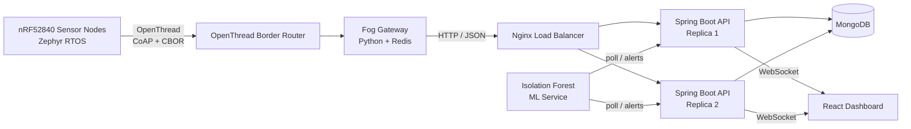

# Thread-Based Intelligent Indoor Environmental Monitoring System

An academic **Smart Sensor Network System (SSNS)** for real-time indoor environmental monitoring. The project combines **nRF52840 sensor nodes**, **Zephyr RTOS**, **OpenThread / IEEE 802.15.4**, **CoAP + CBOR**, **fog computing**, a **Spring Boot + MongoDB** backend, a **React** dashboard, and an **Isolation Forest** machine-learning service for anomaly detection.

> Developed as a team project for the Smart Sensors and Network Systems course in the M.Sc. High Integrity Systems program at Frankfurt University of Applied Sciences.

## Project idea

Indoor environmental monitoring systems have to remain useful even when connectivity is unstable and when sensor values contain short-lived noise. This project therefore uses a multi-tier architecture that moves part of the processing closer to the edge, buffers data during outages, and combines deterministic safety rules with statistical heuristics and unsupervised machine learning.

The monitored environmental variables include:

- CO₂ using **SCD41**
- Particulate matter using **SPS30**
- TVOC using **CCS811**
- Temperature and humidity

## System architecture

### Data flow

`I2C sensors → OpenThread (CoAP/CBOR) → Fog Gateway → HTTP/JSON → Nginx → Spring Boot → MongoDB → WebSocket → React Dashboard`

The ML service is intentionally decoupled from the synchronous ingestion path and polls the backend independently.

## Edge and network layer

The sensor nodes are based on the **Nordic nRF52840 Development Kit** and run **Zephyr RTOS**. Sensor acquisition is implemented with independent producer threads and a centralized network consumer thread, with mutex protection for shared data.

Key networking choices:

- IEEE 802.15.4 radio
- IPv6-based OpenThread mesh networking
- Router-eligible Full Thread Devices (FTDs)
- CoAP over UDP
- CBOR payload encoding
- OpenThread Border Router (OTBR)

Sensor values are sampled every **6 seconds**, while aggregated statistics are transmitted every **30 seconds** to reduce RF overhead.

## Fog layer and fault tolerance

The fog gateway bridges the constrained Thread network and the backend. It performs:

- CoAP packet reception
- CBOR decoding
- Message deduplication using Redis `SETNX`
- Store-and-forward buffering using Redis queues
- HTTP forwarding to the backend
- Exponential-backoff retry during connectivity failures

The edge node also maintains a **50-packet RAM queue**. At a 30-second transmission interval, this provides **25 minutes of offline buffering** during a network partition.

## Backend and dashboard

The platform layer uses:

- **Java Spring Boot** for REST APIs and ingestion
- **MongoDB** for telemetry persistence
- **Nginx** for Layer 7 load balancing
- **WebSockets** for low-latency dashboard updates
- **React + Vite** for the operator dashboard
- **Material UI**, **Recharts**, and **React Flow** for visualization
- **Docker / Docker Compose** for deployment and service isolation

The dashboard uses a bounded client-side sliding window of up to **10,000 records** to avoid browser memory exhaustion during high-frequency telemetry.

## Alerting and machine learning

The project combines several independent alerting mechanisms rather than relying on a single detector:

1. **Static safety rules** for explicit environmental thresholds.
2. **Heuristic rules** for transient and multi-sensor events.
3. **Hardware-health rules** for invalid or sentinel sensor values.
4. **Isolation Forest ML** for unsupervised anomaly detection.
5. **Forecasting** for trend-based early warning.

The ML pipeline transforms each sensor packet into a **12-dimensional feature vector**, applies robust scaling, and performs Isolation Forest inference. Feature attribution is provided using absolute Z-score ranking.

### Evaluation results

An offline evaluation used a **2.8-day single-room dataset**, with the first 24 hours used for baseline calibration and the remaining period used for streaming evaluation.

| Metric | Result |
|---|---:|
| True Positive Rate | **77.31%** |
| False Positive Rate | **0.45%** |
| False Negative Rate | **22.69%** |
| CO₂ detection latency | **584 s** |
| Confirmation window | **50 consecutive readings** |
| Forecasting MAE (CO₂, 30 min) | **1664.5 ppm** |
| Forecasting RMSE (CO₂, 30 min) | **1776.5 ppm** |

The forecasting results also exposed an important limitation: a linear trend model is not well suited to abrupt step-ramp hazards, so rapid-onset events remain the responsibility of the static, heuristic, and ML alert engines.

## Live mesh behavior

During hardware testing, **two independent Border Routers and three sensor nodes** self-organized into a Thread mesh. A temporary partition caused both Border Routers to independently elect themselves as leaders; after connectivity was restored, the mesh reconciled automatically to a single leader without manual intervention.

## Documentation

- **Project report:** [`docs/SSNS_Project_Report.pdf`](docs/SSNS_Project_Report.pdf)
- **LaTeX source:** [`paper/main.tex`](paper/main.tex)
- **Presentation:** [Gamma — Thread-Based Intelligent Indoor Environmental Monitoring System](https://gamma.app/docs/Thread-Based-Intelligent-Indoor-Environmental-Monitoring-System-a6d3s97ftyguy9f?mode=doc)

> Note: this repository currently focuses on the project report and technical documentation. The complete implementation source code is not included in the attached project materials.

## Future work identified in the project

- Move edge buffering from volatile RAM to Zephyr NVS flash
- Add CoAP-over-DTLS and stronger authentication
- Migrate orchestration toward Kubernetes
- Add MCUboot-based OTA firmware updates
- Evaluate the ML pipeline on a larger multi-room dataset
- Derive anomaly confirmation windows analytically per anomaly type
- Re-evaluate forecasting on gradual environmental trends

## Team

- Haris Tauseef Khan
- Mobeen Anwar
- Muhammad Faris Mufti
- Muhammad Inayat Hussain
- Muhammad Saleem
- Sohail Asghar Minhas

M.Sc. High Integrity Systems  
Frankfurt University of Applied Sciences, Germany
